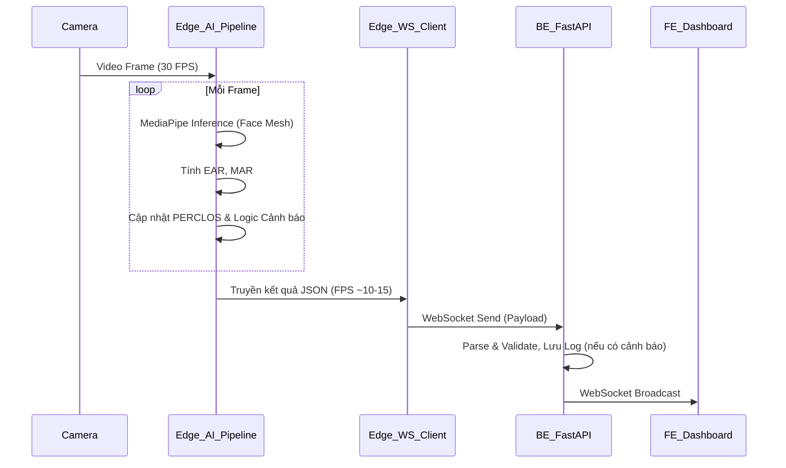

# TỔNG QUAN THIẾT KẾ LOGIC PHẦN MỀM (AI & BACKEND)

## 1. Mục tiêu và Phạm vi
Tài liệu này mô tả kiến trúc logic tổng thể cho dự án Phát hiện tài xế buồn ngủ (Driver Monitoring System) tập trung vào 2 thành phần cốt lõi:
- **Edge AI Logic (Model & Inference)**: Xử lý video stream, trích xuất đặc trưng (EAR, MAR, PERCLOS) và đưa ra dự đoán dựa trên Rule-based.
- **Backend Logic**: Server nhận luồng dữ liệu liên tục từ Edge qua WebSocket và phân phối (broadcast) đến các Client/Dashboard, đồng thời ghi log.

*Lưu ý: Không bao gồm thiết kế giao diện Frontend (FE) và thiết lập môi trường/phần cứng Raspberry Pi.*

## 2. Kiến trúc Hệ thống Logic (System Architecture)

Luồng xử lý (Data Flow) diễn ra theo mô hình thời gian thực (Real-time Pipeline):

## 3. Cấu trúc thư mục dự án đề xuất
Dựa trên cấu trúc folder hiện có, việc tổ chức source code logic nên theo định hướng sau:

- `/be`: 
  - `main.py`: Điểm vào (Entry point) của FastAPI, cấu hình routing và WebSocket.
  - `ws_manager.py`: Quản lý các kết nối WebSocket (Connection Manager).
  - `models.py`: Pydantic schema cho payload dữ liệu.
  
- `/edge`:
  - `pipeline.py`: Chứa class cấu trúc chu trình (read frame -> inference -> gửi ws).
  - `features.py`: Chứa các hàm tính toán EAR, MAR, PERCLOS.
  - `detector.py`: Đóng gói MediaPipe và rule-based thresholding.
  - `ws_client.py`: Logic kết nối WebSocket từ Edge lên Server (sử dụng thư viện `websockets` hoặc `socket.io-client`).

- `/configs`:
  - `edge.yaml`: Tham số hệ thống cho AI (ngưỡng EAR, MAR, window_size, ws_url).
  - `training.yaml`: (Chưa dùng trong phase 5 ngày này do đang dùng Rule-based, có thể dùng sau này nếu train mô hình LSTM).

## 4. Kế hoạch Phát triển Logic theo Giai đoạn
- **Bước 1 (Giai đoạn AI Core):** Xây dựng `features.py` và `detector.py`. Đảm bảo tính toán chính xác EAR, MAR trên ảnh tĩnh/video offline.
- **Bước 2 (Giai đoạn Backend Core):** Xây dựng FastAPI và WebSocket Endpoint, dùng script giả lập (mock_client.py) gửi dữ liệu thử nghiệm.
- **Bước 3 (Tích hợp AI & BE):** Xây dựng `ws_client.py` và `pipeline.py` ở mục Edge, kết nối trực tiếp với BE cục bộ (Localhost/LAN).
- **Bước 4 (Tối ưu Rule & Log):** Tinh chỉnh ngưỡng trong `edge.yaml` sau khi test, viết thêm API lưu trữ các lần cảnh báo nguy hiểm trên Backend.
